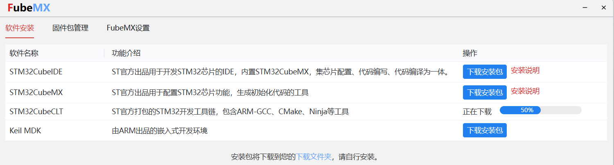

# TEF

#### 介绍
集美大学科来战队电控培训

#### 软件架构
cubemx、keil、Clion、ozone、vofa+


#### 安装教程

安装包：[fubemx](https://fubemx.keysking.com/)


#### 使用说明
在TEF_Orientation文件夹中将每一次培训任务做成了单独的代码工程
```markdown
# 项目文档框架

## 1. 概述
- 项目简介
- 主要功能
- 硬件/软件组成

## 2. 硬件模块说明
### 2.1 key_led
- 功能描述
- 接口定义
- 使用示例

### 2.2 one_3508 (电机驱动)
- 技术参数
  - 型号：3508
  - 通信方式：CAN
- 接线说明
- 控制协议

### 2.3 3508_12_CAN_RX (CAN通信接口)
- 引脚定义
- 配置参数
- 数据格式

### 2.4 NVIC_3 (中断控制)
- 中断优先级配置
- 相关寄存器说明
- 典型应用场景

### 2.5 remote_control (遥控器)
- 支持协议
- 配对方法
- 通道映射表

### 2.6 OLED_0.96_IIC (显示模块)
- 屏幕参数
  - 尺寸：0.96英寸
  - 接口：IIC
- 驱动库说明
- 显示效果示例


电机、传感器、stm32、树莓派、蓝牙、WiFi、oled、sbus遥控器
freertos、rt_thread
can、uart、iic、spi、rs485、
linux

#### 参与贡献

1.  Fork 本仓库
2.  新建 Feat_xxx 分支
3.  提交代码
4.  新建 Pull Request


#### 特技

1.  使用 Readme\_XXX.md 来支持不同的语言，例如 Readme\_en.md, Readme\_zh.md
2.  Gitee 官方博客 [blog.gitee.com](https://blog.gitee.com)
3.  你可以 [https://gitee.com/explore](https://gitee.com/explore) 这个地址来了解 Gitee 上的优秀开源项目
4.  [GVP](https://gitee.com/gvp) 全称是 Gitee 最有价值开源项目，是综合评定出的优秀开源项目
5.  Gitee 官方提供的使用手册 [https://gitee.com/help](https://gitee.com/help)
6.  Gitee 封面人物是一档用来展示 Gitee 会员风采的栏目 [https://gitee.com/gitee-stars/](https://gitee.com/gitee-stars/)
